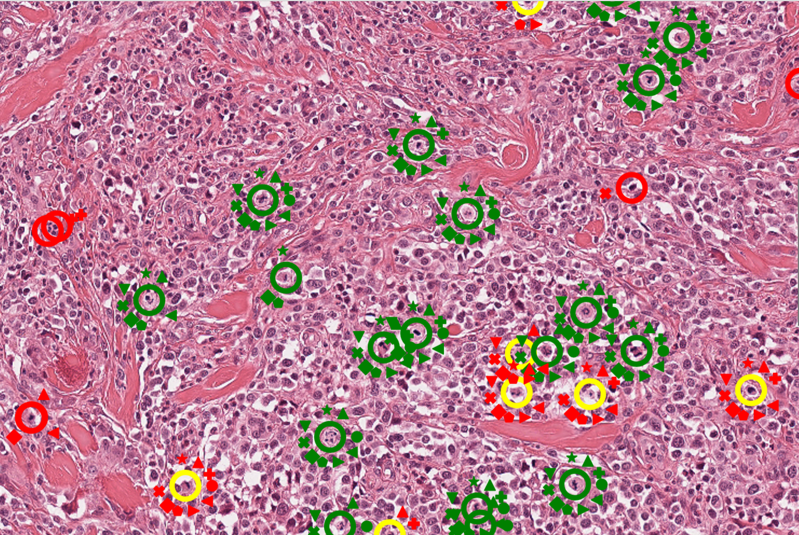

# Deep Learning-Based Quantification of PulmonaryHemosiderophages in Cytology Slides


## Installation & SetUp


[Docker](https://hub.docker.com/r/bronzidocker/eiphwsi):
```docker
docker pull bronzidocker/eiphwsi
docker run -p 8888:8888 bronzidocker/eiphwsi
```

Afterwards, please download the whole slide images with the following notebook. !Under Review!

### Slides

After downloading, the slides can be examined with [SlideRunner](https://github.com/DeepPathology/SlideRunner) or [EXACT](https://github.com/ChristianMarzahl/Exact). Annotations for [SlideRunner](Slides/SDATA_Final_Annotations.sqlite).


## Publications

This repository is the baseline for multiple publication in the field of deep learning-based quantification of pulmonary hemosiderophages in Cytology Slides

## Nature Scientific Reports: [Deep Learning-Based Quantification of PulmonaryHemosiderophages in Cytology Slides](https://www.nature.com/articles/s41598-020-65958-2)

For details, please visit the [SREP](SREP) section of this repository.

<a href="http://www.youtube.com/watch?feature=player_embedded&v=6azMAYpsyRw" target="_blank"></a>


### Abstract:
Exercise-induced pulmonary hemorrhage (EIPH) is a common condition in sport horses with negative impact on performance. Cytology of bronchoalveolar lavage fluid by use of a scoring system is considered the most sensitive diagnostic method. Macrophages are classified depending on the degree of cytoplasmic hemosiderin content. The current gold standard is manual grading, which is however monotonous and time-consuming. We evaluated state-of-the-art deep learning-based methods for single cell macrophage classification and compared them against the performance of nine cytology experts and evaluated inter- and intra-observer variability. Additionally, we evaluated object detection methods on a novel data set of 17 completely annotated cytology whole slide images (WSI) containing 78,047 hemosiderophages. Our deep learning-based approach reached a concordance of 0.85, partially exceeding human expert concordance (0.68 to 0.86, mean of 0.73, SD of 0.04). Intra-observer variability was high (0.68 to 0.88) and inter-observer concordance was moderate (Fleiss’ kappa = 0.67). Our object detection approach has a mean average precision of 0.66 over the five classes from the whole slide gigapixel image and a computation time of below two minutes. To mitigate the high inter- and intra-rater variability, we propose our automated object detection pipeline, enabling accurate, reproducible and quick EIPH scoring in WSI.

## Real deep learning can generalise to more than one species: A Comparative Three Species Whole Slide Image Dataset


For details, please visit the [SREP](SDATA) section of this repository.


## MICCAI: Are fast labeling methods reliable? a case study of computer-aided expert annotations on microscopy slides

For details, please visit the [MICCAI2020](MICCAI2020) section of this repository.




### Abstract:
Deep-learning-based pipelines have recently shown the potential to revolutionalize microscopy image diagnostics by providing visual augmentations and evaluations to a trained pathology expert. However, to match human performance, the methods rely on the availability of vast amounts of high-quality labeled data, which poses a significant challenge today. To circumvent this, augmented labeling methods, also known as expert-algorithm-collaboration, have recently become popular. Yet, potential biases introduced by this operation mode and their effects for training deep neuronal networks are not entirely understood. 

This work aims to shed light on some of the effects by providing a case study for three relevant diagnostic settings: First, the labeling of different, well separable classes of cells on a cytology slide. Second, the grading of stained cells with regards to their approximated dye-concentration. Lastly, mitotic figure detection - a prominent task in histopathologic tumor grading. Ten trained pathology experts performed the tasks first  without and later with computer-generated augmentation. To investigate different biasing effects, we intentionally introduced errors to the augmentation. Furthermore, we developed a novel loss function which incorporates the experts' annotation consensus to train a deep learning classifier.


In total, ten pathology experts annotated 26,015 cells on 1,200 images in this novel annotation study. Backed by this extensive data set, we found that the concordance with multi-expert consensus was significantly increased in the computer-aided setting, versus the annotation from scratch. However, a significant percentage of the deliberately introduced false labels was not identified by the experts. Additionally, we showed that our loss function profited from multiple experts and outperformed conventional loss functions. At the same time, systematic errors did not lead to a deterioration of the trained classifier accuracy.

## BVM: [Is Crowd-Algorithm Collaboration an Advanced Alternative to Crowd-Sourcing on Cytology Slides?](https://link.springer.com/chapter/10.1007/978-3-658-29267-6_5)

For details, please visit the [BVM_2020](BVM_2020) section of this repository.


### Abstract:
Modern, state-of-the-art deep learning approaches yield human like performance in numerous object detection and classification tasks. The foundation for their success is the availability of training datasets of substantially high quantity, which are expensive to create, especially in the field of medical imaging. Crowdsourcing has been applied to create large datasets for a broad range of disciplines. This study aims to explore the challenges and opportunities of crowd-algorithm collaboration for the object detection task of grading cytology whole slide images. We compared the classical crowdsourcing performance of twenty participants with their results from crowd-algorithm collaboration. All participants performed both modes in random order on the same twenty images. Additionally, we introduced artificial systematic flaws into the precomputed annotations to estimate a bias towards accepting precomputed annotations. We gathered 9524 annotations on 800 images from twenty participants organised into four groups in concordance to their level of expertise with cytology. The crowd-algorithm mode improved on average the participants' classification accuracy by 7{\%}, the mean average precision by 8{\%} and the inter-observer Fleiss' kappa score by 20{\%}, and reduced the time spent by 31{\%}. However, two thirds of the artificially modified false labels were not recognised as such by the contributors. This study shows that crowd-algorithm collaboration is a promising new approach to generate large datasets when it is ensured that a carefully designed setup eliminates potential biases.