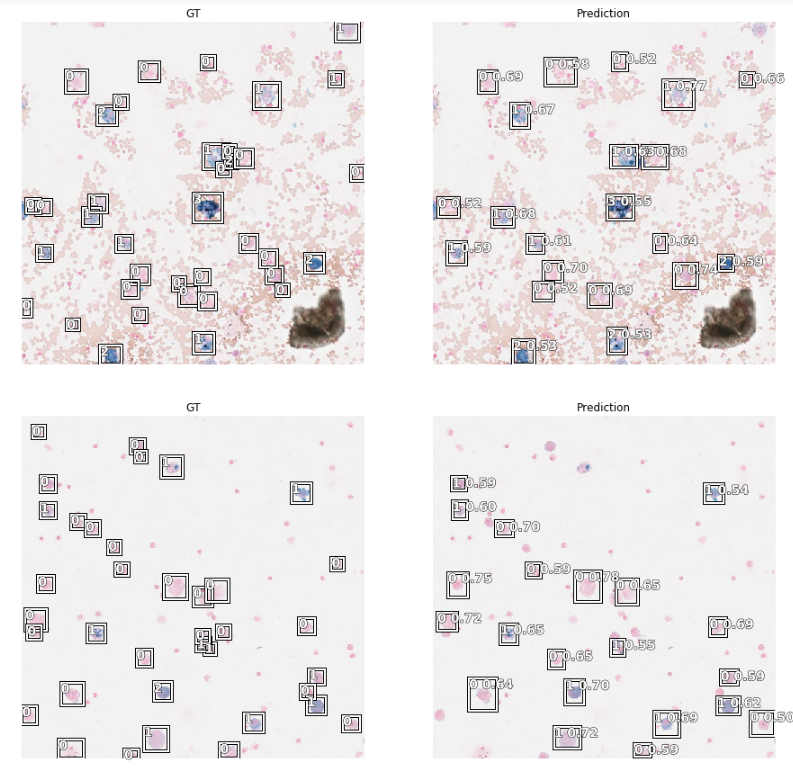
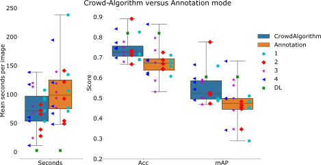

# Deep Learning-Based Quantification of PulmonaryHemosiderophages in Cytology Slides


## Installation & SetUp

Docker:
```docker
docker pull bronzidocker/eiphwsi
docker run -p 8888:8888 bronzidocker/eiphwsi
```

Afterwards, please download the whole slide images with the following notebook

### Slides

After downloading, the slides can be examined with [SlideRunner](https://github.com/DeepPathology/SlideRunner) or [EXACT](https://github.com/ChristianMarzahl/Exact). A script to upload the slides and annotations to an EXACT instance can be found in the following notebook. The annotations for SlideRunner are within the slide folders.


## Publications

This repository is the baseline for multiple publication in the field of deep learning-based quantification of pulmonary hemosiderophages in Cytology Slides

## [Deep Learning-Based Quantification of PulmonaryHemosiderophages in Cytology Slides](https://www.nature.com/articles/s41598-020-65958-2)

For details, please visit the [SREP](SREP/README.md) section of this repository.

<a href="http://www.youtube.com/watch?feature=player_embedded&v=6azMAYpsyRw" target="_blank"></a>




## Real deep learning can generalise to more than one species: A Comparative Three Species Whole Slide Image Dataset


For details, please visit the [SREP](SDATA/README.md) section of this repository.

<object data="SDATA/Paper/Overview.pdf" type="application/pdf" width="700px" height="700px">
    <embed src="SDATA/Paper/Overview.pdf">
        <p>This browser does not support PDFs. Please download the PDF to view it: <a href="SDATA/Paper/Overview.pdf">Download PDF</a>.</p>
    </embed>
</object>


## [Is Crowd-Algorithm Collaboration an Advanced Alternative to Crowd-Sourcing on Cytology Slides?](https://link.springer.com/chapter/10.1007/978-3-658-29267-6_5)

For details, please visit the [SREP](SREP/README.md) section of this repository.


