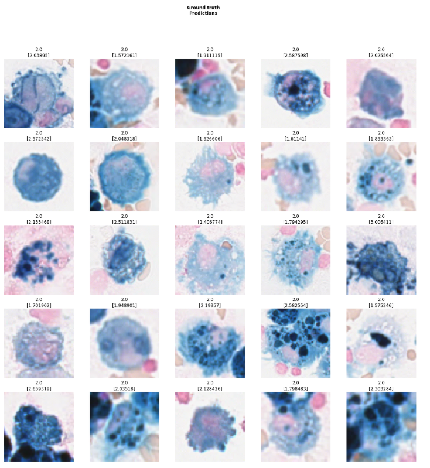
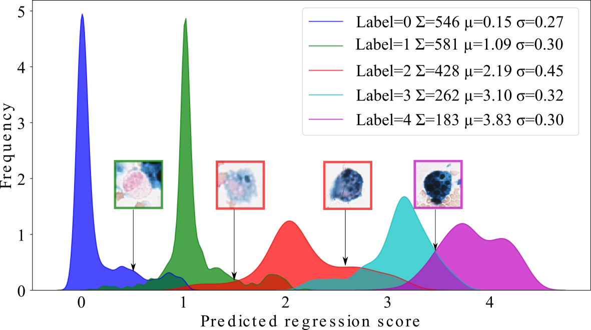
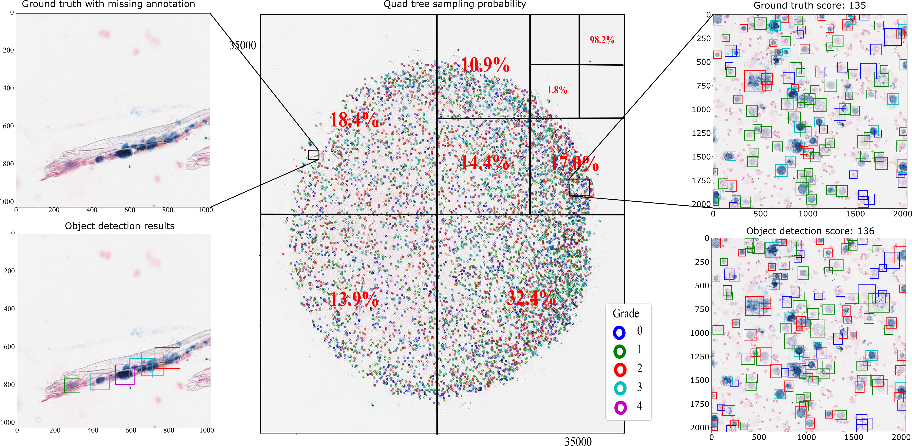
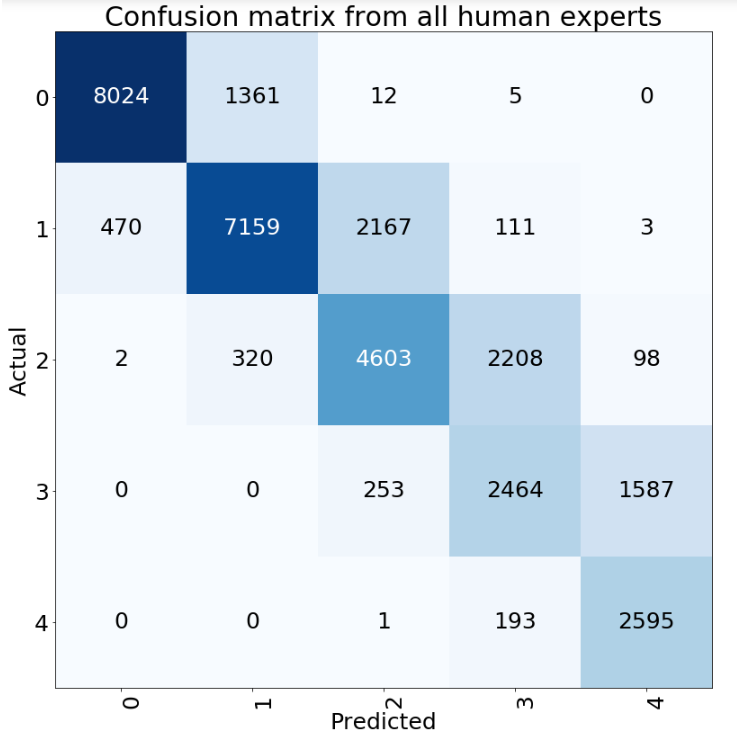

# Deep Learning-Based Quantification of PulmonaryHemosiderophages in Cytology Slides

## SREP

This repository contains code to replicate the results from the paper:
[Deep Learning-Based Quantification of Pulmonary Hemosiderophages in Cytology Slides](https://www.nature.com/articles/s41598-020-65958-2) and links to corresponding jupyter notebooks. 

#### Regression:

The following [notebook](SREP/Regression/baseline.ipynb) generates the cell-based regression scores per cell and trains the model. 

The following [notebook](SREP/Regression/baseline.ipynb) generates the cell-based regression map. 

#### QuadTree:

The following [notebook](SREP/QuadTree/QTree.ipynb) generates the quad tree. 

#### Object Detection

The following [notebook](SREP/Detection/baseline-level0.ipynb) traines RetinaNet on the EIPH dataset with the following results. 

#### Results 

The following [notebook](SREP/Statistics/ClassificationResults.ipynb) calculates some metrics used in the paper. 

## BVM 2020

Results from the BVM paper [Is Crowd-Algorithm Collaboration an Advanced Alternative to Crowd-Sourcing on Cytology Slides?](BVM_2019/README.md)