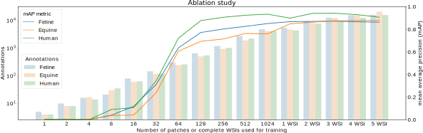

# Real deep learning can generalise to more than one species: A Comparative Three Species Whole Slide Image Dataset

[](https://lbesson.mit-license.org/)

This repository contains code to replicate the results from the paper:
[Real deep learning can generalise to more than one species: A Comparative Three Species Whole Slide Image Dataset](https://arxiv.org/abs/2108.08529) and links to corresponding jupyter notebooks. 
The dataset can be examined at [EXACT](https://exact.cs.fau.de/) with the username ```SDATA_EIPH_2021``` and the password ```SDATA_ALBA```

## Paper

```
@article{marzahl2021MultipleSpecies,
  author    = {Christian Marzahl and
               Jenny Hill and
               Jason Stayt and
               Dorothee Bienzle and
               Lutz Welker and
               Frauke Wilm and
               J{\"{o}}rn Voigt and
               Marc Aubreville and
               Andreas K. Maier and
               Robert Klopfleisch and
               Katharina Breininger and
               Christof A. Bertram},
  title     = {Inter-Species Cell Detection: Datasets on pulmonary hemosiderophages
               in equine, human and feline specimens},
  journal   = {CoRR},
  volume    = {abs/2108.08529},
  year      = {2021},
  url       = {https://arxiv.org/abs/2108.08529},
  abstract  = {Pulmonary hemorrhage (P-Hem) occurs among multiple species and can have various causes. Cytology of bronchoalveolarlavage fluid (BALF) using a 5-tier scoring system of alveolar macrophages based on their hemosiderin content is considered the most sensitive diagnostic method. We introduce a novel, fully annotated multi-species P-Hem dataset which consists of 74 cytology whole slide images (WSIs) with equine, feline and human samples. To create this high-quality and high-quantity dataset, we developed an annotation pipeline combining human expertise with deep learning and data visualisation techniques. We applied a deep learning-based object detection approach trained on 17 expertly annotated equine WSIs, to the remaining 39 equine, 12 human and 7 feline WSIs. The resulting annotations were semi-automatically screened for errors on multiple types of specialised annotation maps and finally reviewed by a trained pathologists. Our dataset contains a total of 297,383 hemosiderophages classified into five grades. It is one of the largest publicly availableWSIs datasets with respect to the number of annotations, the scanned area and the number of species covered.}
  eprinttype = {arXiv},
  eprint    = {2108.08529},
  timestamp = {Mon, 23 Aug 2021 14:07:13 +0200},
  biburl    = {https://dblp.org/rec/journals/corr/abs-2108-08529.bib},
  bibsource = {dblp computer science bibliography, https://dblp.org}
}


```

## Start and Structure

- Please install the [requirements.txt](requirements.txt) ```pip install -r requirements.txt```
- Download the slides [Download.ipynb](Download.ipynb)
- Install Openslide for Linux ```!apt-get install python3-openslide``` or Windows https://openslide.org/download/
- The folder [Statistics](Statistics) contains notebooks which analyse the dataset annotations
and general information about the slides
- [Inference](Inference) contains code to train the described models and perform inference on
slides.
- [Regression](Regression) trains the regression models to predict a continuous EIPH grade and is used for creating the density
maps
- [Cluster](Cluster) contains code to create custom annotation maps and synchronise the generated images and annotations with
EXACT.

### Notebooks

| Section | Species | Name | Describtion |
| :---:  | :---:  | :---  |  :--- |
| -  | - | [Download.ipynb](Download.ipynb)  | Download the WSI files from Figshare  |
|   | | |  |
| Cluster  | - | [ClusterCellsBySize.ipynb](Cluster/ClusterCellsBySize.ipynb)  | Notebook to cluster the cells by size as described in the paper section  [***2.6  Semi-automatic data cleaning via customised clustering***](https://arxiv.org/abs/2108.08529) |
| Cluster | Feline   | [Create_DensityWSI-Cat.ipynb](Cluster/Create_DensityWSI-Cat.ipynb)  | Notebook to cluster the cat cells by their EIPH score as described  in the paper section  [***2.8  Density map***](https://arxiv.org/abs/2108.08529) |
| Cluster | Equine | [Create_DensityWSI-Equine.ipynb](Cluster/Create_DensityWSI-Equine.ipynb)  | Notebook to cluster the equine cells by their EIPH score as described  in the paper section  [***2.8  Density map***](https://arxiv.org/abs/2108.08529) |
| Cluster | Human | [Create_DensityWSI-Human.ipynb](Cluster/Create_DensityWSI-Human.ipynb)  | Notebook to cluster the human cells by their EIPH score as described  in the paper section  [***2.8  Density map***](https://arxiv.org/abs/2108.08529) |
| Cluster | - | [SyncSizeClusterResults.ipynb](Cluster/SyncSizeClusterResults.ipynb)  | Notebook to sync changes made by the pathologist in EXACT on the density maps to the original WSIs  [***2.8  Density map***](https://arxiv.org/abs/2108.08529) |
|   |  | | |
| Inference | - | [FilterInferenceResults.ipynb](Inference/FilterInferenceResults.ipynb)  | Notebook to the perform non-maximum-suppression  and confidence thresholding on the inference results  [***2.5  Inter-species inference from a pre-trained model***](https://arxiv.org/abs/2108.08529) |
| Inference | - | [UploadPickleToEXACT](Inference/UploadPickleToEXACT.ipynb)  | Notebook to upload  the inference results to EXACT |
| Inference | - | [Fine-tune-SREP-V2](Inference/Fine-tune-SREP-V2.ipynb)  | Notebook to fine-tune the deep learning-based object detection model on the new V2 annotations [***4.1  Reevaluation of the inference step***](https://arxiv.org/abs/2108.08529) |
| Inference | Equine | [EquineFold-1-VS-HumanCat](CrossFold/EquineFold-1-VS-HumaneCat.ipynb)  | Train on the first equine fold an validate on the human and feline samples. |
| Inference | Equine | [EquineFold-2-VS-HumanCat](CrossFold/EquineFold-1-VS-HumaneCat.ipynb)  | Train on the second equine fold an validate on the human and feline samples. |
| Inference | Equine | [EquineFold-3-VS-HumanCat](CrossFold/EquineFold-1-VS-HumaneCat.ipynb)  | Train on the third equine fold an validate on the human and feline samples. |
| Inference | - | [Fine-tune-SREP-V2-Ablation](Inference/Fine-tune-SREP-V2-Ablation.ipynb)  | Notebook to fine-tune the deep learning-based object detection model on the new V2 annotations in an ablation manner with an increasing number of annotations [***4.1  Reevaluation of the inference step***](https://arxiv.org/abs/2108.08529) |
| Inference | - | [TrainSREP-V2](Inference/TrainSREP-V2.ipynb)  | Notebook to train the deep learning-based object detection model on the new V2 annotations [***4.1  Reevaluation of the inference step***](https://arxiv.org/abs/2108.08529) |
|   |  | | |
| Domain Adaptation | Feline | [CatvsCat](Inference/Cat/CatvsCat.ipynb)  | Notebook to train the deep learning-based object detection model on cat WSI and validate on cat WSI [***4.2  Inter-species domain adaptation***](https://arxiv.org/abs/2108.08529) |
| Domain Adaptation | Feline | [CatvsEquine](Inference/Cat/CatvsEquine.ipynb)  | Notebook to train the deep learning-based object detection model on cat WSI and validate on equine WSI [***4.2  Inter-species domain adaptation***](https://arxiv.org/abs/2108.08529) |
| Domain Adaptation | Feline | [CatvsHuman](Inference/Cat/CatvsHuman.ipynb)  | Notebook to train the deep learning-based object detection model on cat WSI and validate on human WSI [***4.2  Inter-species domain adaptation***](https://arxiv.org/abs/2108.08529) |
| Domain Adaptation | Equine | [EquineVsCat](Inference/Equine/EquineVsCat.ipynb)  | Notebook to train the deep learning-based object detection model on equine WSI and validate on cat WSI [***4.2  Inter-species domain adaptation***](https://arxiv.org/abs/2108.08529) |
| Domain Adaptation | Equine | [EquineVsEquine](Inference/Equine/EquineVsEquine.ipynb)  | Notebook to train the deep learning-based object detection model on equine WSI and validate on equine WSI [***4.2  Inter-species domain adaptation***](https://arxiv.org/abs/2108.08529) |
| Domain Adaptation | Equine | [EquineVsHuman](Inference/Equine/EquineVsHuman.ipynb)  | Notebook to train the deep learning-based object detection model on equine WSI and validate on human WSI [***4.2  Inter-species domain adaptation***](https://arxiv.org/abs/2108.08529) |
| Domain Adaptation | Human | [HumanVsCat](Inference/Human/HumanVsCat.ipynb)  | Notebook to train the deep learning-based object detection model on human WSI and validate on cat WSI [***4.2  Inter-species domain adaptation***](https://arxiv.org/abs/2108.08529) |
| Domain Adaptation | Human | [HumanVsEquine](Inference/Human/HumanVsEquine.ipynb)  | Notebook to train the deep learning-based object detection model on human WSI and validate on equine WSI [***4.2  Inter-species domain adaptation***](https://arxiv.org/abs/2108.08529) |
| Domain Adaptation | Human | [HumanVsHuman](Inference/Human/HumanVsHuman.ipynb)  | Notebook to train the deep learning-based object detection model on human WSI and validate on human WSI [***4.2  Inter-species domain adaptation***](https://arxiv.org/abs/2108.08529) |
| Domain Adaptation results | - | [CrossSpeciesValidation](Statistics/CrossValidation/CrossSpeciesValidation.ipynb)  | Notebook to analyse the inter-species cross-validation results [***4.2  Inter-species domain adaptation***](https://arxiv.org/abs/2108.08529) |
| Domain Adaptation results | - | [SourceTargetDomainVisualisation](Statistics/CrossValidation/SourceTargetDomainVisualisation.ipynb)  | Notebook to visualise the inter-species cross-validation results [***4.2  Inter-species domain adaptation***](https://arxiv.org/abs/2108.08529) |
|   |  | | |
| Ablation study | Feline | [CatVsCatAblation](Inference/Cat/CatVsCatAblation.ipynb)  | Notebook to train the deep learning-based object detection model to perform an ablation study on an increasing number of slides.  [***4.3  Ablation study***](https://arxiv.org/abs/2108.08529) |
| Ablation study | Equine | [EquineVsEquineAblation](Inference/Equine/EquineVsEquineAblation.ipynb)  | Notebook to train the deep learning-based object detection model to perform an ablation study on an increasing number of slides.  [***4.3  Ablation study***](https://arxiv.org/abs/2108.08529) |
| Ablation study | Human | [HumanVsHumanAblation](Inference/Human/HumanVsHumanAblation.ipynb)  | Notebook to train the deep learning-based object detection model to perform an ablation study on an increasing number of slides.  [***4.3  Ablation study***](https://arxiv.org/abs/2108.08529) |
| Ablation study results | - | [AblationStudy](Statistics/AblationStudy/AblationStudy.ipynb)  | Notebook to present the annotation study results as figures for the final paper.  [***4.3  Ablation study***](https://arxiv.org/abs/2108.08529) |
| Ablation study results | - | [TableAblationStudyAnnotations](Statistics/AblationStudy/TableAblationStudyAnnotations.ipynb)  | Notebook to show the annotation  study results.  [***4.3  Ablation study***](https://arxiv.org/abs/2108.08529) |
|   |  | | |
| Regression | Equine | [baseline-Regression](Regression/baseline-Regression.ipynb)  | Notebook to train the deep learning-based regression model to predict continuous  EIPh scores.  [***2.8  Density map***](https://arxiv.org/abs/2108.08529) |
| Regression | Equine | [SetScoresAtEXACT](Regression/SetScoresAtEXACT.ipynb)  | Notebook to set the predicted EIPh scores at all cells on EXACT.  [***2.8  Density map***](https://arxiv.org/abs/2108.08529) |
|   |  | | |
| Annotation statistics | Equine | [AnnotationVersionStatistics-SDATA-Equine](Statistics/Versions/AnnotationVersionStatistics-SDATA-Equine.ipynb)  | Equine annotation statistics.  [***2  Methods***](https://arxiv.org/abs/2108.08529) |
| Annotation statistics | Feline | [AnnotationVersionStatistics-SDATA-Feline](Statistics/Versions/AnnotationVersionStatistics-SDATA-Cat.ipynb)  | Feline annotation statistics.  [***2  Methods***](https://arxiv.org/abs/2108.08529) |
| Annotation statistics | Human | [AnnotationVersionStatistics-SDATA-Human](Statistics/Versions/AnnotationVersionStatistics-SDATA-Human.ipynb)  | Human annotation statistics.  [***2  Methods***](https://arxiv.org/abs/2108.08529) |
| Annotation statistics SREP | Human | [AnnotationVersionStatistics-SREP](Statistics/Versions/AnnotationVersionStatistics-SREP.ipynb)  | Annotation statistics from the SREP publication.  [***2  Methods***](https://arxiv.org/abs/2108.08529) |
| Annotation statistics total | Human | [AnnotationVersionStatistics-Total](Statistics/Versions/AnnotationVersionStatistics-Total.ipynb)  | Annotation statistics from the final publication.  [***2  Methods***](https://arxiv.org/abs/2108.08529) |
| WSIs area | - | [AreaAndScreeing](Statistics/AreaAndScreeing.ipynb)  | Calculates the area of the WSIs  [***2  Methods***](https://arxiv.org/abs/2108.08529) |
|   |  | | |
| Download annotations SREP | Equine | [DownloadAnnotationsSREP](Statistics/DownloadAnnotationsSREP.ipynb)  | Download the annotations for the original SREP dataset.  [***2  Methods***](https://arxiv.org/abs/2108.08529) |
| Download annotations | Equine | [DownloadAnnotationsSDATA_Equine](Statistics/DownloadAnnotationsSDATA_Equine.ipynb)  | Download the annotations for the SDATA dataset.  [***2  Methods***](https://arxiv.org/abs/2108.08529) |
| Download annotations | Feline | [DownloadAnnotationsSDATA_CAT](Statistics/DownloadAnnotationsSDATA_CAT.ipynb)  | Download the annotations for the SDATA dataset.  [***2  Methods***](https://arxiv.org/abs/2108.08529) |
| Download annotations | Human | [DownloadAnnotationsSDATA_Human](Statistics/DownloadAnnotationsSDATA_Human.ipynb)  | Download the annotations for the SDATA dataset.  [***2  Methods***](https://arxiv.org/abs/2108.08529) |

# Troubleshooting

If you are facing the following error message at GitHub 

```
Sorry, something went wrong. Reload?
```

Please use:

https://nbviewer.jupyter.org/github/ChristianMarzahl/EIPH_WSI/tree/master/SDATA/


## Object detection library
For object detection on whole slide images (WSI), we use code from this  https://github.com/ChristianMarzahl/ObjectDetection repository.
If you are using the repository or parts thereof, please cite the corresponding [paper](https://www.nature.com/articles/s41598-020-65958-2):
```
@article{marzahl2020deep,
  title={Deep learning-based quantification of pulmonary hemosiderophages in cytology slides},
  author={Marzahl, Christian and Aubreville, Marc and Bertram, Christof A and Stayt, Jason and Jasensky, Anne-Katherine and Bartenschlager, Florian and Fragoso-Garcia, Marco and Barton, Ann K and Elsemann, Svenja and Jabari, Samir and Jens, Krauth and Prathmesh, Madhu and Jörn, Voigt and Jenny, Hill and Robert, Klopfleisch and Andreas, Maier },
  journal={Scientific Reports},
  volume={10},
  number={1},
  pages={1--10},
  year={2020},
  publisher={Nature Publishing Group}
}
```


## Overview


Overview of the macrophage annotation and validation pipeline: The RetinaNet object-detection model trained on
16 equine slides4
is used to perform inference on the remaining slides, followed by a semi-automatic clustering step which
clusters cells by size. Error-prone cells are highlighted and can then be efficiently deleted by a human expert. Afterwards, a
human expert screens all WSI to increase the dataset consistency. Finally, a regression-based clustering system is applied to
support experts searching for misclassifications of the hemosiderin grade.


## Species confusion matrix


Results of the ablation study using our customised RetinaNet object detector on an increasing number of humane,
equine and feline training patches of size 1024 x 1024 pixel from one WSI or up to five complete WSIs. The boxes represent
the total number of hemosiderophages used for training in combination with the mAP graphs for each species.

## Species confusion matrix


Each of the nine figures show on the left the species source training domain and on the top the species target domain
with the obtained mAP. Green bounding boxes represent grade zero hemosiderophages while red show grade one
