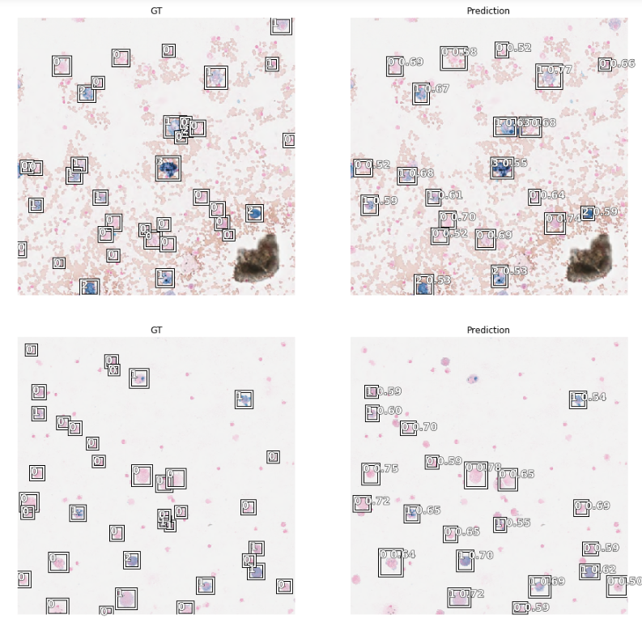

# [Deep Learning-Based Quantification of PulmonaryHemosiderophages in Cytology Slides](https://www.nature.com/articles/s41598-020-65958-2)

This repository contains code to replicate the results from the paper:
[Deep Learning-Based Quantification of Pulmonary Hemosiderophages in Cytology Slides](https://www.nature.com/articles/s41598-020-65958-2) and links to corresponding jupyter notebooks. 

## Abstract
```

Exercise-induced pulmonary hemorrhage (EIPH) is a common condition in sport horses with negative impact on performance. Cytology of bronchoalveolar lavage fluid by use of a scoring system is considered the most sensitive diagnostic method. Macrophages are classified depending on the degree of cytoplasmic hemosiderin content. The current gold standard is manual grading, which is however monotonous and time-consuming. We evaluated state-of-the-art deep learning-based methods for single cell macrophage classification and compared them against the performance of nine cytology experts and evaluated inter- and intra-observer variability. Additionally, we evaluated object detection methods on a novel data set of 17 completely annotated cytology whole slide images (WSI) containing 78,047 hemosiderophages. Our deep learning-based approach reached a concordance of 0.85, partially exceeding human expert concordance (0.68 to 0.86, mean of 0.73, SD of 0.04). Intra-observer variability was high (0.68 to 0.88) and inter-observer concordance was moderate (Fleiss’ kappa = 0.67). Our object detection approach has a mean average precision of 0.66 over the five classes from the whole slide gigapixel image and a computation time of below two minutes. To mitigate the high inter- and intra-rater variability, we propose our automated object detection pipeline, enabling accurate, reproducible and quick EIPH scoring in WSI.

``` 


<a href="http://www.youtube.com/watch?feature=player_embedded&v=6azMAYpsyRw" target="_blank"></a>


### Regression:

The following [notebook](Regression/baseline.ipynb) generates the cell-based regression scores per cell and trains the model. 


The following [notebook](Regression/baseline.ipynb) generates the cell-based regression map. 


### QuadTree:

The following [notebook](QuadTree/QTree.ipynb) generates the quad tree. 


### Object Detection

The following [notebook](Detection/baseline-level0.ipynb) traines RetinaNet on the EIPH dataset with the following results. 



### Results 

The following [notebook](Statistics/ClassificationResults.ipynb) calculates some metrics used in the paper. 
